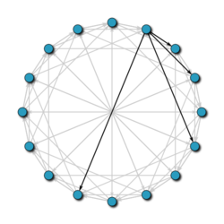
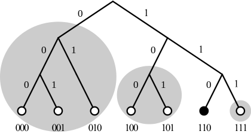
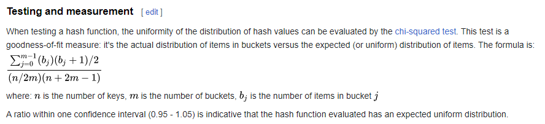

**This is heavily in development, so this is just my brainstorming**

# Searching for peers:

You download someone else's copy of the device, and send your IP to the computer you downloaded it off. 
You then send that IP recursively to each of the IPs the other computer knows and the ones they know etc.

This is not secure, as each computer will know all the other computers IP addresses, Tom just suggested using a 
system where instead of keeping a list of IPs, you keep a list of a few IPs, and send a packet to each of them 
saying "Hi please forward this to all your friends! I want to download this, and I was wondering if any of you had 
this installed?" - I'm trying to work out hash algorithms/ work how magnet: URI schemes work to try and make this 
more secure - I don't know if it will though because I don't know how they work yet.

- This could be useful for Query flooding, but not scalable.

# How to find data:

## Query Flooding
> Inspired by its use in [Gnutella](https://en.wikipedia.org/wiki/Gnutella)
>
> Gnutella once operated on a purely "query flooding"-based protocol. The outdated Gnutella version 0.4 network protocol 
> employs five different packet types, namely:
>- ping: discover hosts on network  
>- pong: reply to ping  
>- query: search for a file  
>- query hit: reply to query  
>- push: download request for firewalled servants
> 
> From Wikipedia 

This sends a message to every device in the network, which makes it very easy to implement, but not scalable whatsoever.
This can also open up possibilities of a DOS attack by bad actors in the network. This could be implemented using a 
Depth First Search, or Breadth First Search, on a graph of all devices on the network.

---
##  Distributed Hash Tables

*Note:  Most DHTs only directly support exact-match search, rather than keyword search. Apparently this can be fixed 
by some routing algorithm? Check Wikipedia for more details, I might mention how I could fix this is in the 
dissertation, but I should at least mention it as a downside.
Also, I may use device and node interchangeably, I am sorry.*

> ### [Pastry](https://en.wikipedia.org/wiki/Pastry_(DHT))
> This [video](https://youtu.be/WqQRQz_XYg4) is incredible for this. Pastry is an overlay network (which is a network 
> layered on top of another network), this works by being supplied with an IP address already in the network. 
> This network does not use packet flooding, allowing for massive 
> scalability! Device/Node IDs are chosen randomly (more information?), so neighbouring computers in the DHT can be 
> nowhere near each other on the network.
> > 'The routing overlay network is formed on top of the hash table by each peer discovering and exchanging state 
> information consisting of a list of leaf nodes, a neighborhood list, and a routing table. The leaf node list 
> consists of the L/2 closest peers by device/node ID in each direction around the circle.' - **Wikipedia**
>
> Routing is performed by, the recipient of the packet will look in its leaf set (**???**) and send it to the closest 
> match. I could do this by:
> -  Iterating through a list of all indexes in the routing table (each one is a hex number, given by whatever 
     > **hash algorithm** I use), and then find the look at the one before and one after, and see which has the 
     > smaller difference. This would be very inefficient for larger sets, but easy to implement.
>
> -  Looking at any which match the first digit of the packet that is not included in your hash 
     > (***Should probably specify how to work out what your hash is!!!***) and send it to the closest match. 
     > If this closest match is you, then you are either the intended recipient (if packet = your hash) or it 
     > doesn't exist (if packet != your hash), This is assuming the hash table contains all combinations for all of 
     > the digits in your hash. This is most likely preferable, as you are not iterating through your entire list, 
     > which may be sizable for larger hash sizes.
>
>> ### PAST
>> Distributed file system made using Pastry.
>> - File is stored by hashing the filename.
>> - These contents are then sent to the node with the most similar name (hashed of course)
>> - This node then distributes copies of this file to *k* nodes nearest the actual key. These should hopefully never 
     > all go offline at the same time. - This seems like a massive weakness!!!
>
>>
>
>## [Chord](https://en.wikipedia.org/wiki/Chord_(peer-to-peer))
> Since this is incredibly similar to Pastry (as shown above), I will state the main differences.
> - Chord is fully 'ring based'. This means each device holds information about parts of the ring and routes packets 
    > to the next device in the ring. I think this may have disadvantages, because if the entire subset is offline, it 
    > won't be able to send the packets to anyone.
> - In chord, each device holds a 'successor list', this means that it can route *around* failed devices in the ring. 
    > This successor list holds the next *k* nodes (typically 3-4) in the ring after the device.
> - This also does not support keyword search, similarly to Pastry.
>
>   
>
>   *A 16-node Chord network. The "fingers" for one of the nodes are in black.*
> - **Finger Tables**: Chord makes each device keep a finger table containing up to *m* entries. where *m* is the 
    > number of bits in the hash key. The *i*th entry of node *n* will contain This seems 
    > relatively similar to a systematic sample to me, but you start from *n* instead of a randomly generated number. 
    > The first entry of the finger table is the device's immediate successor, and every time a device wants to look 
    > up a key *k*, it will send the query to the closest successor or predecessor (depending on the finger table) in 
    > the finger table, until a node finds out the key is stored in its immediate successor.
>
>
>   *I don't understand this, but it could be to do with how each device's 'successor list'. If I pursue this 
> method I will have to do some maths on how to calculate the size of the successor list.*

>## [Kademlia](https://en.wikipedia.org/wiki/Kademlia)
>[ORIGINAL PAPER - Kademlia: A Peer-to-peer Information System
Based on the XOR Metric](http://www.scs.stanford.edu/~dm/home/papers/kpos.pdf)
>
>*The original paper is actually excellent at explaining it, but I think I give an introduction here.*
>
> Devices communicate amongst each other using UDP (User Datagram Protocol), UDP has no handshakes, so you would need 
> TCP (Transmission Control Protocol) or equivalent to check for packet loss etc. These communications specify the 
> structure of the network and are also used to exchange data. Each device is identified by a UUID, this is used for 
> identification and by the **Kademlia Algorithm** to locate values, such as keywords or file hashes. Similarly to 
> Pastry, it finds devices closer and closer to the key until the contacted device returns the value or no closer 
> nodes are found. Kademlia calculates distances between nodes by using XOR upon the key and device UUID. This is 
> because:
> - the distance between a node and itself is zero
> - it is symmetric: the "distances" calculated from *A* to *B* and from *B* to *A* are the same
> - it follows the triangle inequality: given *A*, *B* and *C* are corners of a triangle, then the distance from *A* 
    > to *B* is shorter than or equal to the sum of both the distance from *A* to *C* and the distance from *C* to *B*.
> - It is incredibly cheap and simple.
>
> Also, a network with 2^n nodes will only take n steps (worst case). So it is incredibly efficient.
>
> 
>
> *Visual depiction of Kademlia's routing*
> 
> ### Multiple Files
> Kademlia works if one device/node has multiple files, it does this by storing the file in the network under the 
> location of the files hashed name.
> From the paper:
Kademlia has 4 main commands (RPC's or Remote Procedure Calls):
>- **PING:** Probes a node to see if it is online.
>- **STORE:** Instructs a node to store a <key, value> pair for later retrieval.
>- **FIND_NODE:** Takes a hashed ID, the recipient of this command returns <IP, Port, Node ID>
>for the *k* nodes it knows about closest to the Target ID - this would be where the XOR distance
>function would come in handy I assume. These come from the neighbour lists (K-Buckets). This 
>returns *k* nodes, where k is a given number, such that more than a certain percentage, e.g:
>75% will not fail within an hour. This will return as many as possible up to and including *k*
addresses.
>- **FIND_VALUE:** returns the same as FIND_NODE, apart from if the recipient of this command
>has received a STORE command for the key, then it returns that value.
>### Node Lookups:
>  - It requests the k (typically )
>
---
Hash tables will definitely use DHTs in this project, probably something similar to Kademlia. For this,  the file 
name could be hashed, and have that as the key in a dictionary, then as the value, have the IP(s) of the computer 
who have it installed.
e.g:

    {fca1f234caccf3234fb: [12.34.56.789], [987.65.43.21]...}

Each node should also have lists of each level of similarity to their own hash table. e.g:

    For a binary number "1111":
    [[1000, 1100], [1100, 1110], [1110, 1111]]

*Note: This will be hexadecimal most likely in the actual implementation.*

These could be stored in a json file, such as "node.json".

I will have to make:
- A way to send packets of data to an IPs range of ports.
- - Around 10 ports, in the same way BitTorrent does. (BitTorrent uses 3881 - 3890 I think)
  - This might need port forwarding
- The ability to join this network
- The ability to create "node.json"
- The ability to read "node.json"
- An efficient way to iterate through K-buckets

Make pseudocode for this??

---
# Hashing Functions
*Note: Chi-Squared tests are useful here.*

## SHA3-256

